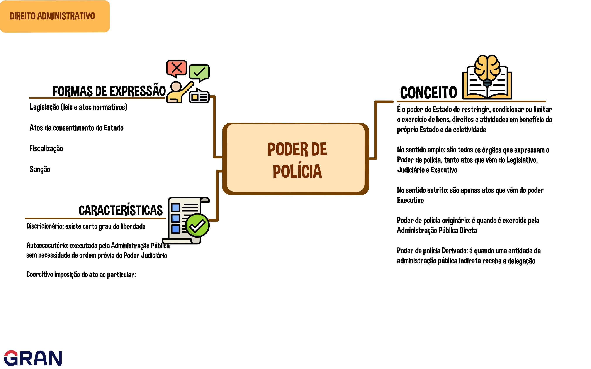

# ✨ Direito Administrativo (Grancursos) - TSE 2024

[Início](./../README.md) | 
[Módulo 02]()

---

## 📚 Módulo 01 - Poderes Administrativos

- [▶️ Aula 01 - Introdução](#aula01)
- [▶️ Aula 02 - Poder Disciplinar](#aula02)
- [▶️ Aula 03 - Poder Hierárquico e Poder Normativo](#aula03)
- [▶️ Aula 04 - Poder de Polícia](#aula04)
- [▶️ Aula 05 - Delegação do Poder de Polícia](#aula05)

### 📌 Aula 01 - Introdução

> ❗ Importante
>
> Não confundir Poderes Administrativos com Poderes do Estado (Executivo, Legislativo e Judiciário) 

> ✅ **Poderes Administrativos** são instrumentos colocados à disposição dos agentes públicos para o exercício da função administrativa.
>

- Poderes administrativos possuem caráter **instrumental**

- O agente público não pode se omitir de usar seus poderes (***poder-dever***, ***dever-poder***)

#### Abuso de Poder

- Outro conceito importante é o de **abuso de poder**:
    - Uso incorreto do poder, seja por ***excesso de poder*** ou por ***desvio de poder***
        - O **excesso** ocorre quando o agente vai além da suas atribuições. O ato nasce violado no elemento ***competência***;
        - O **desvio de poder**, quando o ato nasce violado quanto ao elemento da ***finalidade***, pode ocorrer de duas formas:
            - ato praticado sem observância ao seu fim legal;
            - ato praticado visando fim pessoal.

> ❗ **O abuso de poder pode ser praticado também pela *omissão* (tanto excesso como desvio)**
>
> - Deixar de praticar um ato (omissão) por interesse próprio, como por exemplo: deixar processo de terceiro "engavetado" para prejudicá-lo, poe ele ser um desafeto.

#### Deveres dos Agentes Públicos

- Probidade
- Eficiência
- Prestar Contas
- Agir

---

### 📌 Aula 02 - Poder Disciplinar

- ✅ O **Poder Disciplinar** é o poder que a administração pública tem de punir os **servidores**, pelas suas infrações funcionais, e **particulares** que possuam *vínculo especial* com o poder público (como uma empresa contratada, por exemplo);

    > ❗ Algumas bancas podem se referir ao conceito de **vínculo especial** como *supremacia especial* ou *sujeição especial*

- Esse poder é marcado pela **Discricionariedade**, ou seja, é um poder discricionário;

    > ❗ Essa **discricionariedade** é relacionada à **escolha da sanção** a ser aplicada e **não ao ato de aplicar a sanção**, caso constatada a infração.

- A discricionariedade, em relação à punição aos servidores públicos, decorre do conceito de **Atipicidade** da infração:
    
    - nem todas as infrações estão previstas em lei;
    - na lei os conceitos de infrações são abertas (conduta indecorosa, improbidade, incontinência pública, etc).

#### **Julgados do STJ e STF** quanto ao poder disciplinar:

- **Súmula 611:** é permitida a instauração de PAD (processo adminstrativo disciplinar) com base em denúncia anônima, em face do poder-dever de autotutela imposto à administração;

    > 🤔 ***Autotutela***
    >
    > O princípio da autotutela estabelece que a Administração Pública possui o poder de controlar os próprios atos, anulando-os quando ilegais ou revogando-os quando inconvenientes ou inoportunos.
    >
    > [Link](https://www.jusbrasil.com.br/artigos/o-principio-da-autotutela/433359725)

- **Súmula 635:** os prazos prescricionais das infrações, iniciam-se na data em que a autoridade competente para a abertura do PAD toma conhecimento do fato, interrompendo-se com o primeiro ato de instauração e voltando a correr normalmente após 140 dias desta interrupção;

- **Súmula 641:** a portaria de instauração do PAD prescinde (dispensa) da exposição detalhada dos fatos a serem apurados;

- **Súmula 650:** a autoridade administrativa não dispõe de discricionariedade para aplicar ao servidor pena diferente de demissão quando caracterizada as hipóteses previstas no art. 132 da [Lei nº 8.112/90](https://www.planalto.gov.br/ccivil_03/leis/L8112compilado.htm).

    > ❗ Se a infração se enquadrar em algum caso de demissão previsto na lei 8.112/90, a autoridade competente precisa aplicar a punição de demissão, não podendo optar por outro tipo de punição.

- **Súmula Vinculante (SV) 5 do STF**: a falta de advogado no PAD não viola a Constituição Federal.

    > ❗ Se o servidor que está sofrendo PAD for punido e não tiver optado por levar advogado no decorrer do processo, ele **não pode** alegar violação à ampla defesa e ao contraditório.

#### Observações quanto ao Art 126, Lei 8.112/90

> ▶️ ***"Art. 126.  A responsabilidade administrativa do servidor será afastada no caso de absolvição criminal que negue a existência do fato ou sua autoria."***

- De forma geral, as esferas administrativa, civil e penal são independentes entre si;

    > ✨ um servidor, a partir de um mesmo ato, pode responder independentemente nas esferas administrativas, civil e penal.

- Porém, no caso do servidor ser absolvido na esfera penal por **negativa de fato** ou **negativa de autoria**, também será absolvido nas demais esferas.

    > ❗ **Falta de provas não gera** comunicação nas demais esferas.

---

### 📌 Aula 03 - Poder Hierárquico e Poder Normativo

#### ⏺️ Poder Hierárquico

- ✅ O **Poder Hierárquico** é o poder de estabelecer **hierarquia** entre os órgãos e os agentes públicos;

- Consequências do poder hierárquico:

    - Poder de comando, dar ordens;
    - Poder de fiscalização;
    - Poder de revisão;
    - Poder de delegar e avocar;
    - Poder de punir.

    > ❗ IMPORTANTE
    >
    > Para que possa haver uma **punição**, é necessário existir uma relação de hierarquia. Contudo, o ato de punir está relacionado ao **poder disciplinar**.

- Diferênças entre **delegação** e **avocação**

    > ▶️ Art. 11-18 da [Lei 9.784/99](https://www.planalto.gov.br/ccivil_03/leis/l9784.htm)

    | **Delegação** | **Avocação** |
    | ------------- | ------------ |
    | Delegação é a regra no poder público | Avocação é exceção no poder público  |
    | Não exige hierarquia (porém, o mais comum é a delegação hierarquizada) | Exige hierarquia |
    | Delega-se parte da atribuição | Temporária |
    | Precisa de divulgação, publicação do ato |  |
    | A delegação precisa ser fixada com prazo |  |
    | Pode ser revogada a qualquer momento |  |
    | O delegado (quem recebeu a delegação) é considerado o sujeito autor do ato, ele é responsável pelo ato e não o delegante (quem delegou) |  |

##### Quando não há hierarquia?

- Não há hierarquia:
    - entre os poderes do estado (executivo, legislativo e judiciário)
    - entre os entes da federação (união, estado, DF e municípios)
    - entre administração pública direta e indireta
    - funções típicas no poder legislativo e poder judiciário, exemplos:
        - câmara dos deputados não é subordinada ao senado federal
        - um tribunal não tem relação de hierarquia com outro

#### ⏺️ Poder Normativo (Regulamentar)

- ✅ O **Poder Normativo** é o poder utilizado pela administração pública para editar atos normativos visando a complementação das leis e sua correta aplicação;

> ❗ **IMPORTANTE**
>
>  ▶️ Tradicionalmente, o conceito de **Poder Regulamentar** era utilizado para se referir a faculdade conferida ao administrador público *(exclusivamente o chefe do executivo)* para a expedição de decretos e regulamentos para possibilitar a correta aplicação das leis.
>
> ▶️ O termo **Poder Normativo** é mais recente e mais abrangente, relacionando-se com todos os agentes da administração pública (não somente o chefe do executivo) com competência para editar qualquer ato normativo (não só decreto).

- Existem dois tipos de decreto:
    - **Decreto Regulamentar/Execução:** para fiel execução das leis; fundamentado no Art. 84, IV, CF.
    - **Decreto Autônomo/Independente:** não depende de uma lei anterior;função limitada; fundamentado no Art. 84, VI, CF; utilizado para:
        - organização administrativa interna, desde que não provoque aumento de despesa nem criação ou extinção de órgãos;
        - extinção de cargos vagos.

##### Deslegalização

- O conceito de **deslegalização**, também chamado de **delegificação**, significa a retirada de certas matérias do domínio da lei para que possam ser tratadas no domínio de regulamentos de hierarquia inferior.

---

#### 🧾🎯 Exemplos em Provas

>**Quadrix - CRA PE - Auxiliar de Secretaria - 2023 / [Q2698363](https://questoes.grancursosonline.com.br/aluno/filtro/concursos?tiposProva=1&desatualizada=0&anulada=0&query=Q2698363)**
>
> De acordo com a lei, a doutrina e a jurisprudência, julgue o item, acerca dos poderes e deveres do administrador público.
>
> À luz da Constituição Federal, é possível caracterizar o poder regulamentar como sendo a faculdade conferida ao administrador público (chefe do Executivo) para a expedição de decretos e regulamentos cuja finalidade seja possibilitar a execução das leis ou a organização da administração pública.
>
> Resposta: **Certa**

---

### 📌 Aula 04 - Poder de Polícia

> ❗ Importante
>
> Não confundir **Poder de Polícia** com **Poder da Polícia**. São conceitos diferentes. A polícia faz parte do poder de polícia do Estado , porém o poder de polícia é mais amplo.

- ✅ O **Poder de Polícia** é a faculdade de que dispõe a administração pública para restringir, condicionar ou limitar o exercício de bens, direitos e atividades em benefício do próprio Estado e de toda a Coletividade.

    > ✨ O poder de polícia é bastante amplo. Por exemplo, quando um indivíduo precisa de uma licença concedida pelo Estado para exercer uma determinada profissão (médico, por exemplo), o Estado está exercendo seu poder de polícia.

#### Formas de Expressão (Ciclo do Poder de Polícia)

- O Estado pode expressar o poder de polícia de várias formas:

    - **Legislação -** leis e atos normativos (CTB, por exemplo)
    - **Atos de Consentimento -** concessão de autorização ou licença 
        - Concessão de licença é **ato vinculado**: o Estado precisa deferir, caso quem solicitou preencha todas os requisitos e exigências.
    - **Atos de Fiscalização -** fiscalização de modo geral (fiscalização de trânsito e sanitária, por exemplo)
    - **Atos de Sanção -** aplicação de multas, demolição, interdição, apreensão, etc

#### Conceitos Importantes

- Poder de polícia em sentido amplo e estrito:
    - **sentido amplo -** todos os atos de todos os órgãos
    - **sentido estrito -** provem apenas do poder executivo

- Poder de pólícia originário e derivado:
    - **originário -** quando exercido pela administração pública direta
    - **derivado -** quando exercido por uma entidade da administração indireta, por meio de delegação

- Características do Poder de Polícia:

    - **Discricionário -** exige certo grau de liberdade

        > ❗ O poder de polícia é um ato vinculado (não discricionário) quando exige-se licença para a realização de uma atividade.

    - **Autoexecutório -** executado pela própria administração pública sem necessidade de ordem prévia do poder judiciário

        > ❗ Cobrança de multas não é autoexecutório, deve ser feita por meio judiciário.

    - **Coercitivo -** imposição do ato ao particular, inclusive pelo uso da força pública se necessário.

    > ❗ Outro autor também cita outro atributo, que o de ***Exigibilidade***
    >
    > - A exigibilidade do poder de polícia se dá quando existem ***meios indiretos de coerção ou de coação***.
    >
    > - Por exemplo, a própria aplicação de multa é um meio indireto de coerção para fazer cumprir um ato.

---

#### 🧾🎯 Exemplos em Provas

>**FEPESE - Prefeitura de Balneário Camboriú - Fiscal das Relações de Consumo - 2023 / [Q2712477](https://questoes.grancursosonline.com.br/aluno/filtro/concursos?tiposProva=1&desatualizada=0&anulada=0&query=Q2698363)**
>
> Um fiscal da vigilância sanitária de um determinado município, no exercício de suas funções, adentrou em um restaurante e verificou que algumas lixeiras estavam lotadas de lixo, ocasionando mau cheiro no ambiente e diversos insetos. De imediato acionou o proprietário do restaurante e lacrou o estabelecimento para verificar as condições sanitárias do mesmo.
>
> Nessa situação, o servidor público exerceu o poder:
>
> - ***A. De polícia, que consiste na faculdade de que dispõe a Administração Pública para condicionar ou restringir o uso de bens, o exercício de direitos e a prática de atividades privadas, com a finalidade de proteger os interesses gerais da coletividade.***
>
> - ***B.*** Disciplinar, que consiste em atos repressivos.
>
> - ***C.*** Disciplinar, que consiste em atos preventivos, com características de consentimento da parte interessada.
>
> - ***D.*** Regulamentar, que consiste na punição dos particulares por atos contrários ao interesse publico.
>
> - ***E.*** Hierárquico, que consiste na edição de atos normativos.

#### ✨ Mapa Mental

---

### 📌 Aula 05 - Delegação do Poder de Polícia

> 📢 **ATENÇÃO**
>
> Este assunto é um dos mais importantes dentro do tema de Poder de Polícia

#### Delegação do poder de polícia a particulares

- O Poder de Polícia **NÃO É delegável** para particulares

- Fundamentos legais: [Lei nº 11.079/2004](https://www.planalto.gov.br/ccivil_03/_ato2004-2006/2004/lei/l11079.htm) / [Lei nº 13.019/2014](https://www.planalto.gov.br/ccivil_03/_ato2011-2014/2014/lei/L13019compilado.htm) / Ação Direta de Inconstitucionalidade [ADI nº 1.717](https://www.jusbrasil.com.br/jurisprudencia/stf/772345)

> ❗ Vale ressalvar que ***atos preparatórios*** e ***atos de execução** do poder de polícia podem ser atribuídos a particulares, mas o poder de polícia em si, não pode ser atribuído/delegado.
>
> Por exemplo: 
>   - O Estado pode contratar uma empresa privada para instalar "pardais" em rodovias (*ato preparatório*)
>   - O Estado pode contratar uma empresa privada para executar a demolição de uma obra irregular (*ato de execução*)

#### Casos de delegação do Poder de Polícia

- O poder de polícia **pode ser delegado** para pessoas jurídicas de direito privado **integrantes da Administração Pública indireta**;

- Do ciclo do poder de polícia (ordem, consentimento, fiscalização e sanção), somente a ordem (legislação) não poder ser delegada;

- Empresas estatais e autarquias podem receber delegação de poder de polícia, observando o seguinte entendimento:

    > 📌 **[STF - RE 633782](https://redir.stf.jus.br/paginadorpub/paginador.jsp?docTP=TP&docID=754470241)**
    > 
    > *"É constitucional a delegação do poder de polícia, por meio de **lei**, a pessoas juídicas de direito privado **integrantes da Administração Pública indireta** de **capital social majoritariamente público** que prestem exclusivamente serviço público de atuação própria do Estado e em **regime não concorrencial**"*

#### Espécie tributária

- Os tributos que o Estado pode cobrar para exercer o poder de polícia são as **taxas**;

- O assunto está fundamentado no Art. 145, II, CF e no Art. 98 CTN ([Código Tributário Nacional](http://www.planalto.gov.br/ccivil_03/leis/l5172compilado.htm)).

#### Predominância do interesse

- Competência para praticar atos de poder de polícia:

    - Interesse nacional: **união**;
    - Interesse regional: **estados**;
    - Interesse local: **municípios**.

---

#### 🧾🎯 Exemplos em Provas

>**CESPE / CEBRASPE - PC-SE - Delegado de Polícia - 2018**
>
> Acerca do poder de polícia — poder conferido à administração pública para impor limites ao exercício de direitos e de atividades individuais em função do interesse público —, julgue o próximo item.
>
> *O poder de polícia é indelegável.*
>
> **ERRADA**

>**CESPE/CEBRASPE - TJDFT - Juiz Substituto - 2023 / [Q2719895](https://questoes.grancursosonline.com.br/questoes-de-concursos/direito-administrativo/2719895)**
>
> De acordo com a jurisprudência do STF a respeito do poder de polícia, a teoria do ciclo de polícia compõe-se, em sua totalidade, das fases de
>
> - A. ordem, fiscalização e sanção, sendo apenas a sanção impassível de delegação a pessoas jurídicas de direito privado.
>
> - B. ordem, consentimento, fiscalização e sanção, sendo apenas a sanção impassível de delegação a pessoas jurídicas de direito privado.
>
> - C. ordem, fiscalização e sanção, sendo apenas a fiscalização impassível de delegação a pessoas jurídicas de direito privado.
>
> - D. ordem, consentimento e sanção, sendo apenas o consentimento impassível de delegação a pessoas jurídicas de direito privado.
>
> - ***E. ordem, consentimento, fiscalização e sanção, sendo apenas a ordem impassível de delegação a pessoas jurídicas de direito privado.***